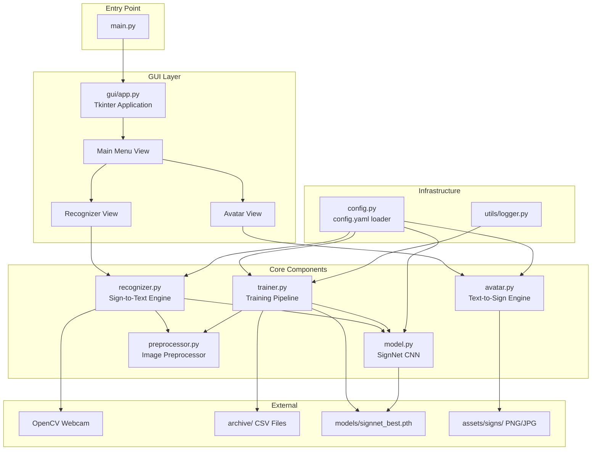
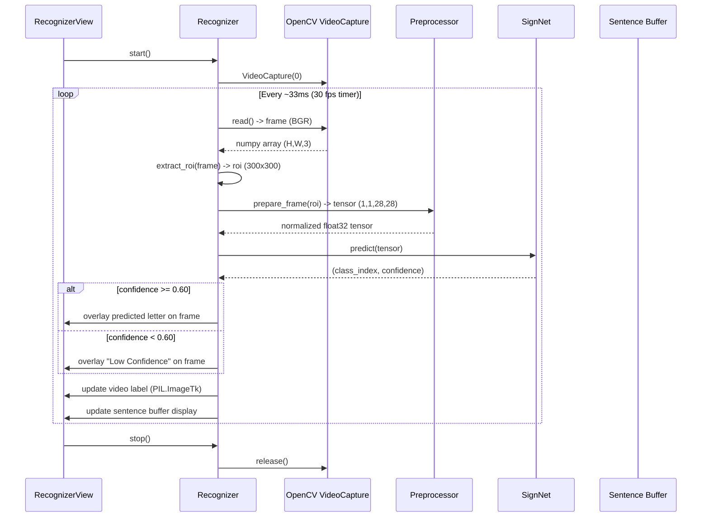
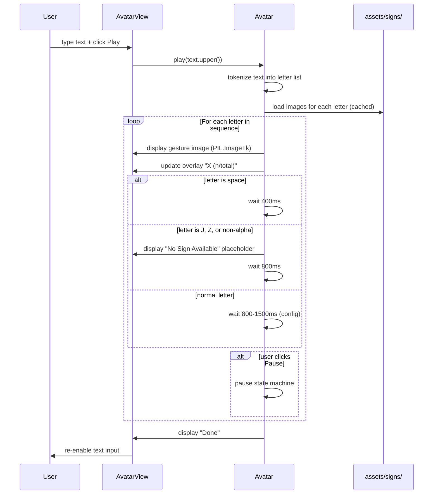
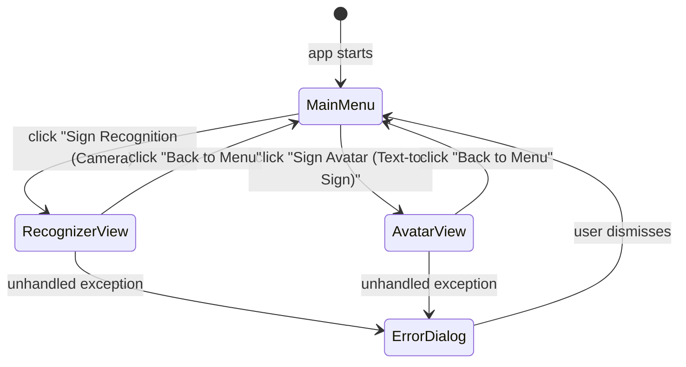

# Design Document: Sign Language Avatar System

## Overview

This document describes the technical design for a local desktop application that provides two-way American Sign Language (ASL) communication. The system recognizes live ASL hand gestures from a webcam and converts them to text (Sign-to-Text), and animates an avatar to display ASL gestures for typed text (Text-to-Sign). Everything runs locally on the user's machine — no cloud infrastructure, no internet connection, and no paid services are required.

> **Note on Infrastructure**: Terraform and cloud services (AWS, Azure, GCP) are not applicable here. This is a standalone Python desktop application. All compute happens on the local CPU or GPU. There are no servers to provision, no containers to deploy, and no network calls at runtime.

---

## 1. System Architecture

The system is composed of six major components that interact through well-defined interfaces:



### Component Responsibilities

| Component | File | Responsibility |
|-----------|------|----------------|
| **main.py** | `main.py` | Entry point; loads config, checks for checkpoint, launches GUI |
| **SignNet** | `src/model.py` | PyTorch CNN; classifies 28×28 grayscale images into 24 ASL classes |
| **Preprocessor** | `src/preprocessor.py` | Converts raw images/frames to normalized float32 tensors |
| **Trainer** | `src/trainer.py` | Loads dataset, trains SignNet, evaluates, saves checkpoint |
| **Recognizer** | `src/recognizer.py` | Captures webcam frames, extracts ROI, runs inference, manages Sentence Buffer |
| **Avatar** | `src/avatar.py` | Loads gesture images, sequences them for typed text, manages playback state |
| **GUI** | `src/gui/app.py` | Tkinter root window; hosts all views, handles navigation and error dialogs |
| **Config** | `src/config.py` | Loads and validates `config.yaml`; provides typed defaults |
| **Logger** | `src/utils/logger.py` | Configures Python logging; writes training logs to `logs/training_log.csv` |

---

## 2. File and Directory Structure

```
sign_language/
├── main.py                        # Entry point: launches GUI
├── train.py                       # Entry point: runs training pipeline
├── config.yaml                    # All configurable parameters
├── requirements.txt               # Pinned Python dependencies
├── README.md                      # Project documentation
│
├── src/
│   ├── __init__.py
│   ├── model.py                   # SignNet CNN class definition
│   ├── preprocessor.py            # Image normalization and tensor conversion
│   ├── trainer.py                 # Training loop, evaluation, checkpoint saving
│   ├── recognizer.py              # Webcam capture, ROI extraction, inference loop
│   ├── avatar.py                  # Gesture image loading, animation sequencing
│   ├── config.py                  # config.yaml loader with typed defaults
│   └── gui/
│       ├── __init__.py
│       ├── app.py                 # Tkinter root window and view manager
│       ├── main_menu.py           # Main menu frame (two mode buttons)
│       ├── recognizer_view.py     # Recognizer frame (camera feed + sentence buffer)
│       └── avatar_view.py         # Avatar frame (text input + animation panel)
│
├── models/
│   └── signnet_best.pth           # Saved model checkpoint (created by train.py)
│
├── assets/
│   └── signs/
│       ├── A.png                  # ASL gesture images (A–Z, excluding J and Z)
│       ├── B.png
│       └── ...                    # One file per static letter
│
├── logs/
│   └── training_log.csv           # Epoch-by-epoch training metrics
│
└── archive/
    ├── sign_mnist_train/
    │   └── sign_mnist_train.csv   # Training dataset (27,455 samples)
    └── sign_mnist_test/
        └── sign_mnist_test.csv    # Test dataset (7,172 samples)
```

### Module Breakdown

**`src/model.py`** — Contains only the `SignNet` class. No training logic, no I/O. Defines the CNN architecture, `forward()` method, and a `predict()` convenience method that returns `(class_index, confidence_score)`.

**`src/preprocessor.py`** — Contains the `Preprocessor` class with two static methods: `prepare_dataset_image(pil_image)` for training-time transforms and `prepare_frame(roi_array)` for inference-time transforms. Both return a `(1, 28, 28)` float32 tensor.

**`src/trainer.py`** — Contains the `Trainer` class. Handles dataset loading via `SignMNISTDataset`, the training loop, validation loop, LR scheduling, checkpoint saving logic, and CSV log writing.

**`src/recognizer.py`** — Contains the `Recognizer` class. Manages the OpenCV `VideoCapture` object, the ROI extraction rectangle, the inference call, the Sentence Buffer string, and keyboard event handling. Designed to be driven by the GUI's event loop via a `step()` method called on a timer.

**`src/avatar.py`** — Contains the `Avatar` class. Loads all gesture images from `assets/signs/` at startup. Exposes `play(text)`, `pause()`, `resume()`, `replay()` methods. Manages an internal animation state machine driven by `after()` callbacks in Tkinter.

**`src/config.py`** — Contains `load_config(path)` which reads `config.yaml` and merges with hardcoded defaults. Returns a plain `dict`. All modules import config via this function.

**`src/gui/app.py`** — The `App(tk.Tk)` root class. Manages a frame stack; `show_frame(name)` swaps the visible frame. Wraps the entire event loop in a try/except that shows a modal error dialog on unhandled exceptions.

**`src/gui/main_menu.py`** — `MainMenuFrame(tk.Frame)`. Two large buttons. Checks checkpoint existence to conditionally disable the Recognition button.

**`src/gui/recognizer_view.py`** — `RecognizerView(tk.Frame)`. Contains a `tk.Label` for the video feed (updated via `PIL.ImageTk`), a read-only `tk.Text` for the Sentence Buffer, and a "Back to Menu" button. Starts/stops the `Recognizer` on show/hide.

**`src/gui/avatar_view.py`** — `AvatarView(tk.Frame)`. Contains a `tk.Entry` for text input, Play/Pause/Resume/Replay buttons, a `tk.Label` for the gesture image, and a progress overlay label.

---

## 3. SignNet CNN Architecture

SignNet is a convolutional neural network that maps a 28×28 single-channel grayscale image to one of 24 ASL letter classes (A–Z, excluding J and Z).

### Layer Definitions

```python
import torch
import torch.nn as nn

class SignNet(nn.Module):
    """
    CNN classifier for 24-class ASL hand gesture recognition.

    Input:  (batch_size, 1, 28, 28)  float32, values in [0.0, 1.0]
    Output: (batch_size, 24)         raw logits (apply softmax for probabilities)
    """

    def __init__(self, num_classes: int = 24, dropout_rate: float = 0.4):
        super().__init__()

        # --- Convolutional Block 1 ---
        # Input:  (B, 1, 28, 28)
        # Output: (B, 32, 14, 14)  after MaxPool
        self.conv_block1 = nn.Sequential(
            nn.Conv2d(in_channels=1, out_channels=32, kernel_size=3, padding=1),
            nn.BatchNorm2d(32),
            nn.ReLU(inplace=True),
            nn.MaxPool2d(kernel_size=2, stride=2),   # 28x28 -> 14x14
        )

        # --- Convolutional Block 2 ---
        # Input:  (B, 32, 14, 14)
        # Output: (B, 64, 7, 7)  after MaxPool
        self.conv_block2 = nn.Sequential(
            nn.Conv2d(in_channels=32, out_channels=64, kernel_size=3, padding=1),
            nn.BatchNorm2d(64),
            nn.ReLU(inplace=True),
            nn.MaxPool2d(kernel_size=2, stride=2),   # 14x14 -> 7x7
        )

        # --- Convolutional Block 3 ---
        # Input:  (B, 64, 7, 7)
        # Output: (B, 128, 3, 3)  after MaxPool (floor division)
        self.conv_block3 = nn.Sequential(
            nn.Conv2d(in_channels=64, out_channels=128, kernel_size=3, padding=1),
            nn.BatchNorm2d(128),
            nn.ReLU(inplace=True),
            nn.MaxPool2d(kernel_size=2, stride=2),   # 7x7 -> 3x3
        )

        # --- Fully Connected Classifier ---
        # Flattened size: 128 * 3 * 3 = 1152
        self.classifier = nn.Sequential(
            nn.Flatten(),
            nn.Linear(128 * 3 * 3, 512),
            nn.ReLU(inplace=True),
            nn.Dropout(p=dropout_rate),              # dropout_rate in [0.3, 0.5]
            nn.Linear(512, 256),
            nn.ReLU(inplace=True),
            nn.Dropout(p=dropout_rate),
            nn.Linear(256, num_classes),             # 24 output logits
        )

    def forward(self, x: torch.Tensor) -> torch.Tensor:
        """Forward pass. Returns raw logits of shape (batch_size, 24)."""
        if x.shape[1:] != (1, 28, 28):
            raise ValueError(
                f"Expected input shape (B, 1, 28, 28), got {tuple(x.shape)}"
            )
        x = self.conv_block1(x)
        x = self.conv_block2(x)
        x = self.conv_block3(x)
        return self.classifier(x)

    def predict(self, x: torch.Tensor) -> tuple[int, float]:
        """
        Run inference on a single image tensor.

        Args:
            x: Tensor of shape (1, 1, 28, 28), float32, values in [0.0, 1.0].

        Returns:
            (class_index, confidence): int in [0, 23] and float in [0.0, 1.0].
        """
        self.eval()
        with torch.no_grad():
            logits = self.forward(x)                 # (1, 24)
            probs = torch.softmax(logits, dim=1)     # (1, 24)
            confidence, class_idx = probs.max(dim=1)
            return int(class_idx.item()), float(confidence.item())
```

### Architecture Summary Table

| Layer | Type | Input Shape | Output Shape | Parameters |
|-------|------|-------------|--------------|------------|
| conv_block1 / Conv2d | Conv2d | (B,1,28,28) | (B,32,28,28) | kernel=3, pad=1 |
| conv_block1 / BatchNorm2d | BN | (B,32,28,28) | (B,32,28,28) | — |
| conv_block1 / ReLU | Activation | — | — | — |
| conv_block1 / MaxPool2d | Pool | (B,32,28,28) | (B,32,14,14) | kernel=2, stride=2 |
| conv_block2 / Conv2d | Conv2d | (B,32,14,14) | (B,64,14,14) | kernel=3, pad=1 |
| conv_block2 / BatchNorm2d | BN | (B,64,14,14) | (B,64,14,14) | — |
| conv_block2 / ReLU | Activation | — | — | — |
| conv_block2 / MaxPool2d | Pool | (B,64,14,14) | (B,64,7,7) | kernel=2, stride=2 |
| conv_block3 / Conv2d | Conv2d | (B,64,7,7) | (B,128,7,7) | kernel=3, pad=1 |
| conv_block3 / BatchNorm2d | BN | (B,128,7,7) | (B,128,7,7) | — |
| conv_block3 / ReLU | Activation | — | — | — |
| conv_block3 / MaxPool2d | Pool | (B,128,7,7) | (B,128,3,3) | kernel=2, stride=2 |
| Flatten | — | (B,128,3,3) | (B,1152) | — |
| Linear(1152→512) | FC | (B,1152) | (B,512) | — |
| ReLU | Activation | — | — | — |
| Dropout(0.4) | Regularization | — | — | p=0.4 |
| Linear(512→256) | FC | (B,512) | (B,256) | — |
| ReLU | Activation | — | — | — |
| Dropout(0.4) | Regularization | — | — | p=0.4 |
| Linear(256→24) | FC | (B,256) | (B,24) | 24 output logits |

**Total trainable parameters**: ~660,000 (well within CPU training budget for 28×28 images)

### Design Rationale

- Three conv blocks with doubling filter counts (32→64→128) progressively extract low-level edges, mid-level shapes, and high-level gesture features.
- BatchNorm after every Conv2d stabilizes training and allows higher learning rates.
- Two Dropout layers (rate 0.4, within the required [0.3, 0.5] range) in the classifier prevent co-adaptation of neurons and reduce overfitting on the ~27k training samples.
- Two hidden FC layers (512 and 256 units) provide sufficient capacity to learn the non-linear decision boundary between 24 similar hand shapes.
- The final layer outputs raw logits; softmax is applied only at inference time (or implicitly by `nn.CrossEntropyLoss` during training).

---

## 4. Data Flow Diagrams

### 4.1 Training Pipeline

```mermaid
sequenceDiagram
    participant CLI as train.py (CLI)
    participant CFG as config.py
    participant DS as SignMNISTDataset
    participant PRE as Preprocessor
    participant NET as SignNet
    participant OPT as Adam Optimizer
    participant SCH as LR Scheduler
    participant LOG as training_log.csv
    participant CHK as models/signnet_best.pth

    CLI->>CFG: load_config("config.yaml")
    CFG-->>CLI: config dict

    CLI->>DS: load CSVs (train + test)
    DS->>PRE: apply augmentation transforms
    PRE-->>DS: (1,28,28) float32 tensors

    loop For each epoch
        CLI->>NET: forward(batch)
        NET-->>CLI: logits (B,24)
        CLI->>OPT: loss.backward() + step()
        CLI->>SCH: scheduler.step(val_loss)
        CLI->>LOG: append {epoch, train_loss, val_accuracy}
    end

    CLI->>DS: evaluate on test set
    DS-->>CLI: test accuracy
    CLI->>CHK: save if accuracy >= previous best
    CLI-->>CLI: print per-class accuracy
```

### 4.2 Inference Pipeline (Sign-to-Text)



### 4.3 Avatar Animation Pipeline (Text-to-Sign)



---

## 5. GUI Design

The GUI is implemented entirely in Tkinter (Python standard library — no extra install required). The application uses a single `tk.Tk` root window with a frame-swapping pattern: only one frame is visible at a time.

### 5.1 View Hierarchy

```
App (tk.Tk)  — window title: "ASL Sign Language System"
├── MainMenuFrame (tk.Frame)
│   ├── Title label: "ASL Sign Language System"
│   ├── Button: "Sign Recognition (Camera)"   [disabled if no checkpoint]
│   └── Button: "Sign Avatar (Text-to-Sign)"
│
├── RecognizerView (tk.Frame)
│   ├── Header label: "Sign Recognition"
│   ├── Video label (tk.Label)               — displays live camera feed
│   ├── Sentence buffer (tk.Text, read-only) — shows accumulated letters
│   ├── Prediction label                     — shows current letter or "Low Confidence"
│   └── Button: "Back to Menu"
│
└── AvatarView (tk.Frame)
    ├── Header label: "Sign Avatar"
    ├── Text input (tk.Entry, max 200 chars)
    ├── Button row: [Play] [Pause] [Resume] [Replay]
    ├── Gesture image label (tk.Label, 400x400)
    ├── Progress overlay label: "A (1/5)"
    ├── Character limit indicator (hidden until 200 chars)
    └── Button: "Back to Menu"
```

### 5.2 Navigation Flow



### 5.3 Frame Swapping Implementation

```python
class App(tk.Tk):
    def __init__(self, config: dict):
        super().__init__()
        self.title("ASL Sign Language System")
        self.config_data = config
        self._frames: dict[str, tk.Frame] = {}
        self._build_frames()
        self.show_frame("MainMenu")

    def _build_frames(self):
        container = tk.Frame(self)
        container.pack(fill="both", expand=True)
        for FrameClass, name in [
            (MainMenuFrame, "MainMenu"),
            (RecognizerView, "Recognizer"),
            (AvatarView, "Avatar"),
        ]:
            frame = FrameClass(container, app=self)
            self._frames[name] = frame
            frame.grid(row=0, column=0, sticky="nsew")

    def show_frame(self, name: str):
        frame = self._frames[name]
        frame.tkraise()

    def show_error(self, exc: Exception):
        import tkinter.messagebox as mb
        mb.showerror("Unexpected Error", str(exc))
        self.show_frame("MainMenu")
```

### 5.4 Camera Feed Update Loop

The Recognizer view drives the camera loop using `after()` to avoid blocking the Tkinter event loop:

```python
def _update_frame(self):
    """Called every 33ms by Tkinter scheduler."""
    frame_bgr = self.recognizer.step()          # returns annotated BGR frame
    if frame_bgr is not None:
        img_rgb = cv2.cvtColor(frame_bgr, cv2.COLOR_BGR2RGB)
        pil_img = Image.fromarray(img_rgb)
        tk_img = ImageTk.PhotoImage(pil_img)
        self.video_label.configure(image=tk_img)
        self.video_label.image = tk_img          # prevent GC
        self.sentence_var.set(self.recognizer.sentence_buffer)
    self._after_id = self.after(33, self._update_frame)
```

---

## 6. config.yaml Schema

All configurable parameters live in `config.yaml` at the project root. Every module reads from this file via `src/config.py`; missing keys fall back to the documented defaults.

```yaml
# config.yaml — Sign Language Avatar System Configuration

# ── Dataset ──────────────────────────────────────────────────────────────────
dataset:
  train_csv: "archive/sign_mnist_train/sign_mnist_train.csv"  # str
  test_csv:  "archive/sign_mnist_test/sign_mnist_test.csv"    # str

# ── Model ─────────────────────────────────────────────────────────────────────
model:
  checkpoint_path: "models/signnet_best.pth"  # str
  num_classes: 24                              # int  — do not change
  dropout_rate: 0.4                            # float in [0.3, 0.5]

# ── Training ──────────────────────────────────────────────────────────────────
training:
  epochs: 20                  # int   — number of full passes over training data
  batch_size: 64              # int   — samples per gradient update
  learning_rate: 0.001        # float — initial Adam learning rate
  weight_decay: 0.0001        # float — L2 regularization coefficient (>= 1e-4)
  scheduler: "ReduceLROnPlateau"  # str — "ReduceLROnPlateau" | "CosineAnnealingLR"
  scheduler_patience: 3       # int   — epochs without improvement before LR drop
  scheduler_factor: 0.5       # float — LR multiplier on plateau

# ── Augmentation ──────────────────────────────────────────────────────────────
augmentation:
  rotation_degrees: 10        # int   — max rotation angle (degrees)
  horizontal_flip: true       # bool  — apply random horizontal flip
  brightness_jitter: 0.2      # float — ColorJitter brightness range
  contrast_jitter: 0.2        # float — ColorJitter contrast range

# ── Inference / Recognizer ────────────────────────────────────────────────────
inference:
  confidence_threshold: 0.60  # float — minimum confidence to display a letter
  roi_size: 300               # int   — ROI bounding box side length in pixels
  camera_index: 0             # int   — OpenCV camera device index
  target_fps: 30              # int   — desired capture frame rate

# ── Avatar ────────────────────────────────────────────────────────────────────
avatar:
  signs_dir: "assets/signs"   # str   — directory containing gesture images
  display_duration_ms: 1000   # int   — ms to show each letter (800–1500)
  space_duration_ms: 400      # int   — ms to show blank frame for spaces
  no_sign_duration_ms: 800    # int   — ms to show placeholder for J, Z, non-alpha
  image_size: 400             # int   — resize all gesture images to this (square)
  max_input_chars: 200        # int   — maximum characters in Avatar text input

# ── Logging ───────────────────────────────────────────────────────────────────
logging:
  log_dir: "logs"                          # str — directory for log files
  training_log_file: "training_log.csv"    # str — filename for epoch metrics
  log_level: "INFO"                        # str — Python logging level
```

### Config Key Reference

| Key Path | Type | Default | Description |
|----------|------|---------|-------------|
| `dataset.train_csv` | str | `archive/sign_mnist_train/sign_mnist_train.csv` | Path to training CSV |
| `dataset.test_csv` | str | `archive/sign_mnist_test/sign_mnist_test.csv` | Path to test CSV |
| `model.checkpoint_path` | str | `models/signnet_best.pth` | Where to save/load weights |
| `model.num_classes` | int | `24` | Number of output classes |
| `model.dropout_rate` | float | `0.4` | Dropout probability in classifier |
| `training.epochs` | int | `20` | Training epochs |
| `training.batch_size` | int | `64` | Mini-batch size |
| `training.learning_rate` | float | `0.001` | Adam initial LR |
| `training.weight_decay` | float | `0.0001` | Adam L2 weight decay |
| `training.scheduler` | str | `ReduceLROnPlateau` | LR scheduler type |
| `augmentation.rotation_degrees` | int | `10` | Max rotation for augmentation |
| `augmentation.horizontal_flip` | bool | `true` | Random horizontal flip |
| `inference.confidence_threshold` | float | `0.60` | Min confidence to show letter |
| `inference.roi_size` | int | `300` | ROI square side length (pixels) |
| `inference.camera_index` | int | `0` | OpenCV camera device index |
| `avatar.signs_dir` | str | `assets/signs` | Gesture image directory |
| `avatar.display_duration_ms` | int | `1000` | Letter display duration (ms) |
| `avatar.space_duration_ms` | int | `400` | Space frame duration (ms) |
| `avatar.max_input_chars` | int | `200` | Max chars in Avatar input |
| `logging.log_dir` | str | `logs` | Log output directory |
| `logging.training_log_file` | str | `training_log.csv` | Training metrics filename |

---

## 7. Key Algorithms

### 7.1 ROI Extraction

The ROI is a fixed 300×300 pixel square centered in the webcam frame. This avoids the complexity of hand detection while giving the user a clear target area.

```python
def extract_roi(frame: np.ndarray, roi_size: int = 300) -> np.ndarray:
    """
    Extract a centered square ROI from a webcam frame.

    Preconditions:
        - frame is a valid numpy array of shape (H, W, 3) or (H, W)
        - roi_size > 0 and roi_size <= min(H, W)

    Postconditions:
        - Returns a numpy array of shape (roi_size, roi_size, C)
        - The ROI is centered in the frame

    Args:
        frame:    BGR or grayscale frame from OpenCV.
        roi_size: Side length of the square ROI in pixels.

    Returns:
        Cropped ROI as a numpy array.
    """
    h, w = frame.shape[:2]
    cx, cy = w // 2, h // 2
    half = roi_size // 2

    x1 = max(0, cx - half)
    y1 = max(0, cy - half)
    x2 = min(w, cx + half)
    y2 = min(h, cy + half)

    return frame[y1:y2, x1:x2]


def draw_roi_rectangle(frame: np.ndarray, roi_size: int = 300) -> np.ndarray:
    """
    Draw the ROI bounding box on the frame for user guidance.

    Returns a copy of the frame with a green rectangle drawn.
    """
    h, w = frame.shape[:2]
    cx, cy = w // 2, h // 2
    half = roi_size // 2
    x1, y1 = cx - half, cy - half
    x2, y2 = cx + half, cy + half
    annotated = frame.copy()
    cv2.rectangle(annotated, (x1, y1), (x2, y2), color=(0, 255, 0), thickness=2)
    return annotated
```

**Loop Invariants for the recognition loop**:
- The ROI coordinates are recalculated each frame (frame dimensions are constant for a given camera session, so this is O(1)).
- The ROI array is always a view or copy of the current frame — it never references a previous frame.

### 7.2 Confidence Scoring

Confidence is the softmax probability of the top predicted class. The threshold (default 0.60) is configurable.

```python
def compute_confidence(logits: torch.Tensor) -> tuple[int, float]:
    """
    Convert raw logits to a predicted class index and confidence score.

    Preconditions:
        - logits has shape (1, 24)
        - logits contains finite float32 values

    Postconditions:
        - class_index is in [0, 23]
        - confidence is in [0.0, 1.0]
        - sum of all softmax probabilities == 1.0

    Args:
        logits: Raw output tensor from SignNet.forward().

    Returns:
        (class_index, confidence) tuple.
    """
    probs = torch.softmax(logits, dim=1)          # (1, 24), sums to 1.0
    confidence, class_idx = probs.max(dim=1)
    return int(class_idx.item()), float(confidence.item())
```

The class index maps to a letter via:

```python
# 24 classes: A=0, B=1, ..., I=8, K=9 (J skipped), L=10, ..., Y=23 (Z skipped)
CLASS_TO_LETTER = {
    i: chr(ord('A') + i + (1 if i >= 9 else 0) + (1 if i >= 25 else 0))
    for i in range(24)
}
# Simpler explicit mapping:
LETTERS = [c for c in 'ABCDEFGHIKLMNOPQRSTUVWXY']  # 24 letters, J and Z excluded
```

### 7.3 Avatar Animation Loop

The Avatar uses a Tkinter `after()` callback chain to sequence gesture images without blocking the event loop. The state machine has four states: IDLE, PLAYING, PAUSED, DONE.

```python
class Avatar:
    """
    Text-to-Sign animation engine.

    State machine:
        IDLE -> PLAYING (on play())
        PLAYING -> PAUSED (on pause())
        PAUSED -> PLAYING (on resume())
        PLAYING -> DONE (sequence exhausted)
        DONE -> PLAYING (on replay() or new play())
        Any -> IDLE (on stop())
    """

    STATES = ("IDLE", "PLAYING", "PAUSED", "DONE")

    def __init__(self, config: dict, display_callback, overlay_callback):
        self.config = config
        self._display_callback = display_callback   # fn(PIL.Image | None)
        self._overlay_callback = overlay_callback   # fn(str)
        self._state = "IDLE"
        self._letters: list[str] = []
        self._index: int = 0
        self._after_id = None
        self._images: dict[str, Image.Image] = {}   # cached gesture images
        self._load_images()

    def _load_images(self):
        """Pre-load all gesture images from assets/signs/ at startup."""
        signs_dir = pathlib.Path(self.config["avatar"]["signs_dir"])
        for letter in "ABCDEFGHIKLMNOPQRSTUVWXY":
            for ext in (".png", ".jpg", ".jpeg"):
                path = signs_dir / f"{letter}{ext}"
                if path.exists():
                    img = Image.open(path).convert("RGB")
                    size = self.config["avatar"]["image_size"]
                    self._images[letter] = img.resize((size, size), Image.LANCZOS)
                    break
            else:
                logging.warning("Missing gesture image for letter: %s", letter)

    def play(self, text: str, after_fn):
        """Start animation for the given text."""
        self._letters = list(text.upper())
        self._index = 0
        self._state = "PLAYING"
        self._after_fn = after_fn
        self._advance()

    def pause(self):
        if self._state == "PLAYING":
            self._state = "PAUSED"
            if self._after_id:
                # Cancel the pending callback
                self._after_id = None

    def resume(self):
        if self._state == "PAUSED":
            self._state = "PLAYING"
            self._advance()

    def replay(self, after_fn):
        self._index = 0
        self._state = "PLAYING"
        self._after_fn = after_fn
        self._advance()

    def _advance(self):
        """Display the current letter and schedule the next step."""
        if self._state != "PLAYING":
            return

        if self._index >= len(self._letters):
            self._state = "DONE"
            self._display_callback(None)
            self._overlay_callback("Done")
            return

        letter = self._letters[self._index]
        total = len(self._letters)
        self._overlay_callback(f"{letter} ({self._index + 1}/{total})")

        duration_ms = self._get_duration(letter)
        image = self._get_image(letter)
        self._display_callback(image)

        self._index += 1
        self._after_id = self._after_fn(duration_ms, self._advance)

    def _get_duration(self, letter: str) -> int:
        cfg = self.config["avatar"]
        if letter == " ":
            return cfg["space_duration_ms"]
        if letter in ("J", "Z") or not letter.isalpha():
            return cfg["no_sign_duration_ms"]
        return cfg["display_duration_ms"]

    def _get_image(self, letter: str):
        if letter == " ":
            return None   # blank frame
        return self._images.get(letter)   # None triggers "No Sign Available"
```

### 7.4 Preprocessor

```python
class Preprocessor:
    """Converts raw images to SignNet-compatible tensors."""

    # Training-time transforms (with augmentation)
    TRAIN_TRANSFORM = transforms.Compose([
        transforms.ToPILImage(),
        transforms.RandomRotation(degrees=10),
        transforms.RandomHorizontalFlip(),
        transforms.ColorJitter(brightness=0.2, contrast=0.2),
        transforms.ToTensor(),          # scales [0,255] -> [0.0,1.0]
    ])

    # Inference-time transforms (deterministic)
    INFER_TRANSFORM = transforms.Compose([
        transforms.ToPILImage(),
        transforms.Grayscale(num_output_channels=1),
        transforms.Resize((28, 28)),
        transforms.ToTensor(),          # scales [0,255] -> [0.0,1.0]
    ])

    @staticmethod
    def prepare_dataset_image(image_array: np.ndarray, augment: bool = True) -> torch.Tensor:
        """
        Prepare a dataset image for training or evaluation.

        Preconditions:
            - image_array is shape (28, 28) uint8, values in [0, 255]

        Postconditions:
            - Returns tensor of shape (1, 28, 28), float32, values in [0.0, 1.0]
        """
        transform = Preprocessor.TRAIN_TRANSFORM if augment else Preprocessor.INFER_TRANSFORM
        tensor = transform(image_array)
        assert tensor.shape == (1, 28, 28), f"Unexpected shape: {tensor.shape}"
        return tensor

    @staticmethod
    def prepare_frame(roi: np.ndarray) -> torch.Tensor:
        """
        Prepare a live webcam ROI for inference.

        Preconditions:
            - roi is a numpy array of shape (H, W, 3) or (H, W), uint8

        Postconditions:
            - Returns tensor of shape (1, 1, 28, 28), float32, values in [0.0, 1.0]
            - Ready to pass directly to SignNet.forward()
        """
        tensor = Preprocessor.INFER_TRANSFORM(roi)   # (1, 28, 28)
        return tensor.unsqueeze(0)                    # (1, 1, 28, 28)
```

---

## 8. Error Handling Strategy

The system uses a layered error handling approach: each component handles errors it can recover from locally, and propagates unrecoverable errors upward to the GUI's global handler.

### 8.1 Error Categories and Responses

| Error | Location | Handling Strategy |
|-------|----------|-------------------|
| Camera not available (`cv2.VideoCapture` returns False) | `Recognizer.start()` | Log error, raise `CameraError`; GUI catches and shows "Camera not available" dialog, returns to main menu |
| Checkpoint file missing | `main.py` startup | Log warning; GUI disables "Sign Recognition" button and shows informational message |
| Checkpoint file corrupt / wrong format | `Recognizer.__init__()` | Catch `RuntimeError` from `torch.load`; show error dialog, disable Recognition mode |
| Invalid tensor shape passed to SignNet | `SignNet.forward()` | Raise `ValueError` with descriptive message; caught by Recognizer, logged, frame skipped |
| Missing gesture image | `Avatar._load_images()` | Log `WARNING`; store `None` for that letter; display "No Sign Available" placeholder at runtime |
| `assets/signs/` directory empty | `Avatar._load_images()` | Log `WARNING`; display setup instruction message in Avatar view |
| CSV file not found | `Trainer.__init__()` | Raise `FileNotFoundError` with path; `train.py` catches and prints actionable message |
| Config key missing | `config.py` | Return documented default; log `DEBUG` message noting the fallback |
| Unhandled exception in GUI event loop | `App` root | `tk.Tk.report_callback_exception` override; show modal error dialog; return to main menu |
| Character limit exceeded in Avatar input | `AvatarView` | Tkinter `validatecommand` on Entry widget; show "Character limit reached" label; reject keystroke |

### 8.2 Custom Exception Classes

```python
# src/exceptions.py

class SignLanguageError(Exception):
    """Base exception for all application errors."""

class CameraError(SignLanguageError):
    """Raised when the webcam cannot be opened or read."""

class ModelError(SignLanguageError):
    """Raised when the model checkpoint is missing or incompatible."""

class AssetError(SignLanguageError):
    """Raised when required asset files are missing."""

class ConfigError(SignLanguageError):
    """Raised when config.yaml contains invalid values."""
```

### 8.3 Global GUI Exception Handler

```python
class App(tk.Tk):
    def report_callback_exception(self, exc_type, exc_value, exc_traceback):
        """Override Tkinter's default exception handler."""
        import traceback
        msg = "".join(traceback.format_exception(exc_type, exc_value, exc_traceback))
        logging.error("Unhandled GUI exception:\n%s", msg)
        self.show_error(exc_value)
```

### 8.4 Training Error Handling

```python
# In train.py
try:
    trainer = Trainer(config)
    trainer.run()
except FileNotFoundError as e:
    print(f"ERROR: Dataset file not found: {e}")
    print("Ensure archive/sign_mnist_train/sign_mnist_train.csv exists.")
    sys.exit(1)
except Exception as e:
    logging.exception("Training failed with unexpected error")
    sys.exit(1)
```

---

## 9. Dependencies and Versions

All dependencies are local — no cloud services, no network calls at runtime.

### 9.1 requirements.txt

```
torch==2.1.0
torchvision==0.16.0
opencv-python==4.8.1.78
PyYAML==6.0.1
pandas==2.1.1
numpy==1.26.0
Pillow==10.0.1
```

> **Tkinter** is part of the Python standard library and does not appear in `requirements.txt`. It is included with Python 3.10+ on Windows and macOS. On Ubuntu/Debian, install with: `sudo apt-get install python3-tk`.

### 9.2 Dependency Roles

| Package | Version | Role |
|---------|---------|------|
| `torch` | 2.1.0 | CNN definition, training loop, inference, tensor operations |
| `torchvision` | 0.16.0 | `transforms` for image augmentation and normalization |
| `opencv-python` | 4.8.1.78 | Webcam capture (`VideoCapture`), frame reading, ROI drawing |
| `PyYAML` | 6.0.1 | Parsing `config.yaml` into Python dicts |
| `pandas` | 2.1.1 | Loading Sign Language MNIST CSV files into DataFrames |
| `numpy` | 1.26.0 | Array operations on image data; pixel manipulation |
| `Pillow` | 10.0.1 | Loading gesture PNG/JPEG assets; converting OpenCV frames to `ImageTk` for Tkinter display |
| `tkinter` | stdlib | GUI framework — main window, frames, labels, buttons, entry fields |

### 9.3 Python Version

**Python 3.10 or higher** is required. The codebase uses:
- `match` statements (Python 3.10+) for state machine logic in `Avatar`
- `tuple[int, float]` return type hints (Python 3.9+)
- `pathlib.Path` (Python 3.4+, but 3.10 recommended for full compatibility)

### 9.4 Hardware Requirements

| Component | Minimum | Recommended |
|-----------|---------|-------------|
| CPU | Any x86-64 | Modern multi-core (Intel i5 / AMD Ryzen 5) |
| RAM | 4 GB | 8 GB |
| GPU | None (CPU inference works) | NVIDIA GPU with CUDA 11.8+ for faster training |
| Webcam | Any USB or built-in | 720p or higher for better ROI quality |
| OS | Windows 10, macOS 12, Ubuntu 20.04 | Windows 11 / macOS 13 / Ubuntu 22.04 |

### 9.5 No Cloud Infrastructure Required

This application runs entirely on the local machine. There are no:
- Cloud functions (AWS Lambda, Azure Functions, Google Cloud Functions)
- Managed databases (DynamoDB, RDS, Firestore)
- Container orchestration (ECS, Kubernetes)
- API gateways or load balancers
- Infrastructure-as-code (Terraform, CloudFormation, Pulumi)

All data (dataset CSVs, model checkpoint, gesture images) is stored on the local filesystem. All compute (training, inference, image processing) runs on the local CPU or GPU. The application can be used completely offline after initial setup.

---

## 10. Correctness Properties

These properties define the invariants that must hold throughout the system's operation. They inform both unit tests and property-based tests.

### 10.1 SignNet Properties

- **Shape invariant**: For any input tensor `x` of shape `(B, 1, 28, 28)` with `B >= 1`, `SignNet.forward(x)` returns a tensor of shape `(B, 24)`.
- **Determinism**: In `model.eval()` mode, calling `forward(x)` twice with the same tensor `x` returns identical results.
- **Confidence bounds**: `predict(x)` always returns `confidence` in `[0.0, 1.0]` and `class_index` in `[0, 23]`.
- **Shape rejection**: `forward(x)` raises `ValueError` for any input not conforming to `(B, 1, 28, 28)`.

### 10.2 Preprocessor Properties

- **Output shape**: `prepare_frame(roi)` always returns a tensor of shape `(1, 1, 28, 28)`.
- **Value range**: All values in the output tensor are in `[0.0, 1.0]`.
- **Idempotency of normalization**: Applying `prepare_frame` twice to the same ROI produces the same tensor (deterministic at inference time).

### 10.3 Avatar Properties

- **Letter coverage**: For every letter `L` in `"ABCDEFGHIKLMNOPQRSTUVWXY"`, if the image file exists in `assets/signs/`, `Avatar._images[L]` is a non-None `PIL.Image` of size `(400, 400)`.
- **Sequence completeness**: `play(text)` will eventually call `_overlay_callback("Done")` for any finite input string, provided the state remains `PLAYING`.
- **Pause/resume idempotency**: Calling `pause()` followed by `resume()` continues from the same letter index.
- **Character limit**: The Avatar input field never contains more than 200 characters.

### 10.4 Recognizer Properties

- **Sentence buffer monotonicity**: The Sentence Buffer only grows (letter append, space append) or shrinks by one character (backspace) per user action — it never resets mid-session except on explicit session start.
- **Confidence gate**: A letter is appended to the Sentence Buffer only when `confidence >= threshold` AND the user triggers an append action (not automatically on every frame).
- **Camera release**: `stop()` always calls `cap.release()` regardless of whether an exception occurred during the session.

---

## 11. Testing Strategy

### 11.1 Unit Tests

Each module has a corresponding test file under `tests/`:

```
tests/
├── test_model.py          # SignNet shape, output range, ValueError on bad input
├── test_preprocessor.py   # Tensor shape, value range, grayscale conversion
├── test_trainer.py        # Dataset loading, checkpoint saving logic
├── test_recognizer.py     # ROI extraction, confidence scoring, sentence buffer ops
├── test_avatar.py         # Image loading, duration logic, state machine transitions
└── test_config.py         # Key loading, fallback defaults, missing key handling
```

### 11.2 Property-Based Tests

Use `hypothesis` for property-based testing of the core inference pipeline:

```python
from hypothesis import given, strategies as st
import torch

@given(st.integers(min_value=1, max_value=8))
def test_signnet_output_shape(batch_size):
    model = SignNet()
    model.eval()
    x = torch.rand(batch_size, 1, 28, 28)
    out = model(x)
    assert out.shape == (batch_size, 24)

@given(st.text(alphabet=st.characters(whitelist_categories=('Lu',)), max_size=50))
def test_avatar_play_terminates(text):
    # Avatar must reach DONE state for any uppercase text input
    ...
```

### 11.3 Integration Tests

- **Training smoke test**: Run 1 epoch on a 100-sample subset; verify `training_log.csv` is created and checkpoint is saved.
- **Inference smoke test**: Load checkpoint, pass a random tensor, verify output shape and confidence range.
- **GUI smoke test**: Launch `App` in headless mode (using `tk.Tk` without display), verify frame navigation does not raise exceptions.

---

## 12. Training Pipeline Detail

### 12.1 SignMNISTDataset

```python
class SignMNISTDataset(Dataset):
    """
    PyTorch Dataset for Sign Language MNIST CSV files.

    CSV format: label, pixel1, pixel2, ..., pixel784
    Labels: 0-23 (A-Y excluding J and Z)
    Pixels: 0-255 uint8, representing 28x28 grayscale image
    """

    def __init__(self, csv_path: str, augment: bool = False):
        df = pd.read_csv(csv_path)
        self.labels = torch.tensor(df["label"].values, dtype=torch.long)
        pixels = df.drop("label", axis=1).values.astype(np.uint8)
        self.images = pixels.reshape(-1, 28, 28)   # (N, 28, 28)
        self.augment = augment

    def __len__(self) -> int:
        return len(self.labels)

    def __getitem__(self, idx: int) -> tuple[torch.Tensor, torch.Tensor]:
        image = self.images[idx]                   # (28, 28) uint8
        tensor = Preprocessor.prepare_dataset_image(image, augment=self.augment)
        return tensor, self.labels[idx]
```

### 12.2 Training Loop

```python
def train_epoch(model, loader, optimizer, criterion, device):
    model.train()
    total_loss = 0.0
    for images, labels in loader:
        images, labels = images.to(device), labels.to(device)
        optimizer.zero_grad()
        logits = model(images)
        loss = criterion(logits, labels)
        loss.backward()
        optimizer.step()
        total_loss += loss.item() * images.size(0)
    return total_loss / len(loader.dataset)

def evaluate(model, loader, device):
    model.eval()
    correct = 0
    with torch.no_grad():
        for images, labels in loader:
            images, labels = images.to(device), labels.to(device)
            logits = model(images)
            preds = logits.argmax(dim=1)
            correct += (preds == labels).sum().item()
    return correct / len(loader.dataset)
```

### 12.3 Checkpoint Saving Logic

```python
def save_if_better(model, accuracy: float, checkpoint_path: str, best_accuracy: float) -> float:
    """
    Save checkpoint only if new accuracy >= previous best.

    Preconditions:
        - accuracy is in [0.0, 1.0]
        - best_accuracy is in [0.0, 1.0]

    Postconditions:
        - If accuracy >= best_accuracy: checkpoint is saved, returns accuracy
        - Otherwise: no file write, returns best_accuracy
    """
    if accuracy >= best_accuracy:
        path = pathlib.Path(checkpoint_path)
        path.parent.mkdir(parents=True, exist_ok=True)
        torch.save(model.state_dict(), path)
        logging.info("Checkpoint saved: %.4f accuracy -> %s", accuracy, path)
        return accuracy
    return best_accuracy
```

---
